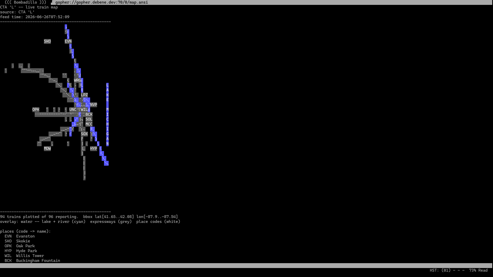

# Deploying gopher-cta

Operational runbook for the live deployment at **`gopher://gopher.debene.dev:70/`**.

> This documents the *running* deployment, not the dev/quickstart flow in the
> README. For local browsing on a laptop, see the README quickstart instead.

---

## What's running

Two containers on the production VPS (RackNerd Chicago, `192.210.238.140`),
orchestrated by Docker Compose:

| Container | Image | Role |
| --- | --- | --- |
| `gopher-cta-fetcher` | `gopher-cta-local:amd64` (or `ghcr.io/felipedbene/gopher-cta:latest`) | Polls the CTA feed every 30s and renders a static gopher tree into `./public` |
| `geo` | `geomyidae:local` (built from `deploy/Dockerfile.geomyidae`) | The gopher daemon; serves `./public/current` on the wire |

They share the `./public` directory: the fetcher writes it, geomyidae serves it
read-only.

### How publishing works (and why it matters)

The fetcher does **not** edit a live tree in place. Each cycle it:

1. renders a complete tree into a fresh `public/out-<nanos>/` snapshot,
2. atomically flips the `public/current` symlink to the new snapshot (`rename(2)`),
3. garbage-collects old snapshots, keeping the newest `KEEP_SNAPSHOTS` (3) plus
   whatever `current` points at.

geomyidae is pointed at `current/`, so a reader always sees a whole tree, never a
half-written one.

**Consequence:** anything that must be served has to be written *into every
snapshot* by the fetcher. A file dropped into `public/` by hand will not be served
— it's not inside `current/`, and the next flip would ignore it anyway. This is
why `robots.txt` and `caps.txt` are embedded in the fetcher binary
(`include_bytes!`) and written into each snapshot by `write_tree()`, not shipped as
loose files.

---

## Prerequisites

- Docker + Docker Compose on the VPS.
- A checkout of this repo on the VPS (the deploy host builds the local image).
- A `.env` file next to `docker-compose.yml` (gitignored):

  ```dotenv
  CTA_TRAIN_API_KEY=<cta train tracker key>   # unset => offline fixture mode
  GOPHER_HOST=gopher.debene.dev               # advertised host in menu links
  GOPHER_PORT=70                              # host port (mapped to 7070 in-container)
  # optional AI narration:
  # CTA_AI_BASE=...
  # CTA_HOME_...=...
  ```

- Inbound TCP **70** open on the VPS firewall.

---

## Image strategy

Production runs the **CI image**: `ghcr.io/felipedbene/gopher-cta:latest`, built
multi-arch (amd64+arm64) by GitHub Actions on every push to `master`, with
`pull_policy: always`. The base `docker-compose.yml` is self-sufficient for
production — `geomyidae`'s advertised host/port come from `$GOPHER_HOST` /
`$GOPHER_PORT` in `.env` (the `-o` flag is the *advertised* port clients reach;
`-p 7070` in the image ENTRYPOINT is the real listen port).

> **Legacy:** production used to run a local build (`gopher-cta-local:amd64`,
> `pull_policy: never`) pinned via a gitignored `docker-compose.override.yml`. That
> override is **retired** under the auto-deploy flow below — delete it so the
> fetcher tracks the CI image. (A local build is still available anywhere for dev
> via `docker compose up -d --build`.)

---

## Deploy / update procedure

**Shipping a change is now automatic.** Push to `master` → CI tests, builds, and
publishes `ghcr:latest` → **Watchtower** on the VPS notices and recreates the
fetcher in place. No SSH, no manual pull. Watchtower runs under the compose
`deploy` profile, polls every 5 min, watches only the fetcher (label-enabled), and
`--cleanup`s the old image.

### One-time setup on the VPS

```bash
cd ~/gopher-cta
rm -f docker-compose.override.yml     # retire the local-build pin (use the CI image)
docker login ghcr.io                  # only if the GHCR package is PRIVATE; skip if public
docker compose --profile deploy up -d # fetcher (CI image) + geomyidae + watchtower
```

If you'd rather not store registry creds, make the package public instead:
GitHub → repo **Packages** → `gopher-cta` → **Package settings** → *Change
visibility* → Public. Then the `~/.docker/config.json` mount on the watchtower
service is a harmless no-op.

After that, **you never deploy by hand** — merge to `master` and wait ~5 min.
Watch it happen with `docker compose logs -f watchtower` (look for
`Found new ... image` / `Stopping ...` / `Creating ...`).

### Manual deploy (fallback / force-now)

```bash
cd ~/gopher-cta
docker compose pull fetcher           # grab the latest CI image immediately
docker compose --profile deploy up -d # recreate changed containers
sleep 35                              # wait for at least one publish cycle (~30s)
```

After it settles, **verify** (see below) before announcing anything.

---

## Verification

From any host that can reach port 70:

```bash
gph() { printf '%s\r\n' "$1" | nc -w5 gopher.debene.dev 70; }

gph "/robots.txt"          # expect: the policy file (User-agent: * / Disallow: /train/)
gph "/train/906.txt"       # expect: a live train detail page (pick a run that's running)
gph "/map.txt"             # expect: the braille map with a recent feed timestamp
```

`nc`-free alternative:

```bash
gph() { python3 -c "import socket,sys;s=socket.create_connection(('gopher.debene.dev',70),5);s.sendall((sys.argv[1]+chr(13)+chr(10)).encode());print(s.recv(8000).decode('utf-8','replace'))" "$1"; }
```

What "good" looks like:

- `/robots.txt` returns the policy text with **no leading `3`** and no `Err` row.
  (A `3...Err` row is geomyidae's error item type — the selector wasn't found.)
- A live run returns data with a fresh `predicted` timestamp.
- A not-in-service run (e.g. `/train/999999.txt`) returns a `3...Err` row — this is
  **expected and fine**: train pages are ephemeral and fenced from crawlers by
  `robots.txt`.

### Visual validation (client render)

End-to-end proof that the ANSI map renders for a real client, captured from a
**headless Raspberry Pi Zero 3W** running the Bombadillo gopher client against
`gopher://gopher.debene.dev:70/0/map.ansi` (framebuffer grab → PNG):



Confirms the full overlay survives the wire: cyan Lake Michigan + river, grey
expressways, white place codes (EVN/SKO/WIL/HYP…), line-coloured trains, and the
`code -> name` legend — "94 trains plotted of 96 reporting." (Raw `.ppm`
framebuffer grabs are gitignored; commit the PNG.)

---

## Why `/train/` is fenced (crawler policy)

CTA run numbers churn as trains enter and leave service, so per-train selectors
(`/train/<run>.txt`) appear and vanish within minutes. Indexing them just fills a
search index (e.g. Floodgap's Veronica-2) with dead links. Everything else — maps,
atlas, landmarks, per-line menus, narrative pages, about, caps — has a **stable
selector** and is safe to index even though its content is live. `robots.txt`
therefore disallows `/train/` only, and sets `Crawl-delay: 30` to match the
publish cadence.

---

## Operational notes

- **Ports:** host `70` → container `7070` (`GOPHER_PORT:7070` mapping + geomyidae
  `-p 7070`). geomyidae runs unprivileged (`USER nobody`), hence the high internal
  port.
- **Restart:** both services are `restart: unless-stopped`, so they come back
  after a reboot. The fetcher resumes publishing; geomyidae resumes serving
  `current/`.
- **Offline mode:** with `CTA_TRAIN_API_KEY` unset, the fetcher serves the bundled
  fixture (`fixtures/positions.json`) — useful for validating a deploy without
  hitting the live feed.
- **Logs:** `docker compose logs -f fetcher` shows each publish
  (`[fetch] published out-<ts> (<n> trains) -> public/current`). geomyidae's
  per-request **access log** (`[<ts>|<ip>|<port>|serving] /selector`) is both
  shown by `docker compose logs -f geomyidae` and persisted to the host at
  **`/var/log/gopher/geomyidae.log`** (bind-mount), so it survives container
  recreation (e.g. Watchtower). One-time host prep — the dir must be writable by
  geomyidae's `nobody` (uid 65534):
  ```sh
  sudo mkdir -p /var/log/gopher && sudo chown 65534:65534 /var/log/gopher
  ```
  `tee -a` keeps the file open, so rotation must use `copytruncate` (a plain `mv`
  would leave geomyidae writing to the rotated inode). A ready-made daily config
  ships at `deploy/logrotate.gopher` (`daily` + `dateext` → one
  `geomyidae.log-YYYYMMDD` per day, ideal for a daily batch job). Install once:
  ```sh
  sudo install -m 644 -o root -g root deploy/logrotate.gopher /etc/logrotate.d/gopher
  sudo logrotate --debug /etc/logrotate.d/gopher    # dry-run; --force to rotate now
  ```
  The distro's `/etc/cron.daily/logrotate` then rotates it once per day.
- **Disk:** snapshots are GC'd to the newest 3 + current, so `public/` stays
  bounded.

---

## Observability — visitor analytics (separate surface)

The serving stack above lives on this VPS. **Who visits it** is a *second,
independent deployment* on a homelab **k8s** cluster (namespace `observability`),
which never touches the serving containers — it only reads this VPS's rotated
access log over SSH.

**Status (verified 2026-06-26):** the dashboard ConfigMap is applied and Grafana
renders it, but the **CronJob and its SSH Secret are not yet applied** — the data
in Loki is a one-shot manual push (`scripts/visitors-to-loki.sh`), so it does not
refresh on its own. Apply the Secret + `deploy/visitors-cronjob.yaml` to turn the
daily feed on.

Pipeline (daily, once the CronJob is applied): k8s CronJob `gopher-visitors-batch` ssh-`cat`s the
*yesterday-dated* `geomyidae.log-YYYYMMDD` → enriches offline (MaxMind ASN +
reverse DNS + human/bot verdict) → pushes NDJSON to in-cluster Loki
(`{job="gopher-cta-visitors"}`, every field in the line body, query with
LogQL `| json`) → Grafana's `grafana-sc-dashboard` sidecar auto-loads the
dashboard ConfigMap into the "Gopher-CTA" folder.

Note the namespaces differ: Loki + the dashboard ConfigMap are in
`observability`, but Grafana (`monitoring-grafana`, kube-prometheus-stack) is in
`monitoring`. The dashboard crosses over only because the sidecar watches
`grafana_dashboard=1` in *all* namespaces — narrowing that scope would silently
drop it.

This VPS's only role is to **keep the access log readable**: the bind-mounted
`/var/log/gopher` (see the Logs note above) plus a dedicated, command-restricted
SSH key in `~/.ssh/authorized_keys`:

```
command="cat /var/log/gopher/geomyidae.log-*",no-port-forwarding,no-pty <pubkey>
```

Everything else is in the cluster. Runbooks live with the manifests, not here:
- `deploy/visitors-cronjob.yaml` header — build/push the `gopher-cta-visitors`
  image, create the SSH-key Secret, apply, test/backfill.
- `deploy/grafana-visitors-dashboard-configmap.yaml` header — how the dashboard
  ConfigMap is provisioned; edit `deploy/grafana-visitors-dashboard.json` then
  regenerate it.
- `scripts/README.md` — the enrich/push tooling, including `visitors-remote.sh`
  for ad-hoc local runs against the live VPS log (no cluster needed).

---

## Troubleshooting

### `robots.txt` (or any embedded file) 404s with `3...Err`

Almost always a **stale local image**. `robots.txt`/`caps.txt` are compiled into
the fetcher binary, so a running binary that doesn't emit them was built before
that code existed. The fetcher republishing fresh train data is *not* evidence the
binary is current — only a rebuild updates the embedded files.

Fix: `git pull && docker compose build fetcher && docker compose up -d`, wait one
cycle, re-verify. Confirm the commit is actually in this checkout with:

```bash
git -C ~/gopher-cta log --oneline -- robots.txt src/fetch.rs
```

### Menu links / error rows show `localhost` instead of `gopher.debene.dev`

geomyidae's advertised host (`-h`) isn't applied. The override sets it, but `geo`
may not have been recreated. Force it:

```bash
docker compose up -d geomyidae
docker inspect geo --format '{{.Args}}'   # confirm -h gopher.debene.dev -o 70 present
```

Cosmetic — it affects the `server`/`port` tokens geomyidae substitutes into menus
and error rows, not whether content serves.

### Can't reach port 70 at all, but 80/443 work

Server's up; port 70 is filtered between you and the VPS (some egress proxies block
the gopher port). Test from a different network, or check the VPS firewall allows
inbound 70.

### geomyidae won't start after a Dockerfile rebuild

The geomyidae image clones from `git://bitreich.org` (port 9418). The build host
needs 9418 egress. If the clone fails, the image build fails — rebuild from a host
that allows it, or pin `GEOMYIDAE_REF` to a cached layer.
